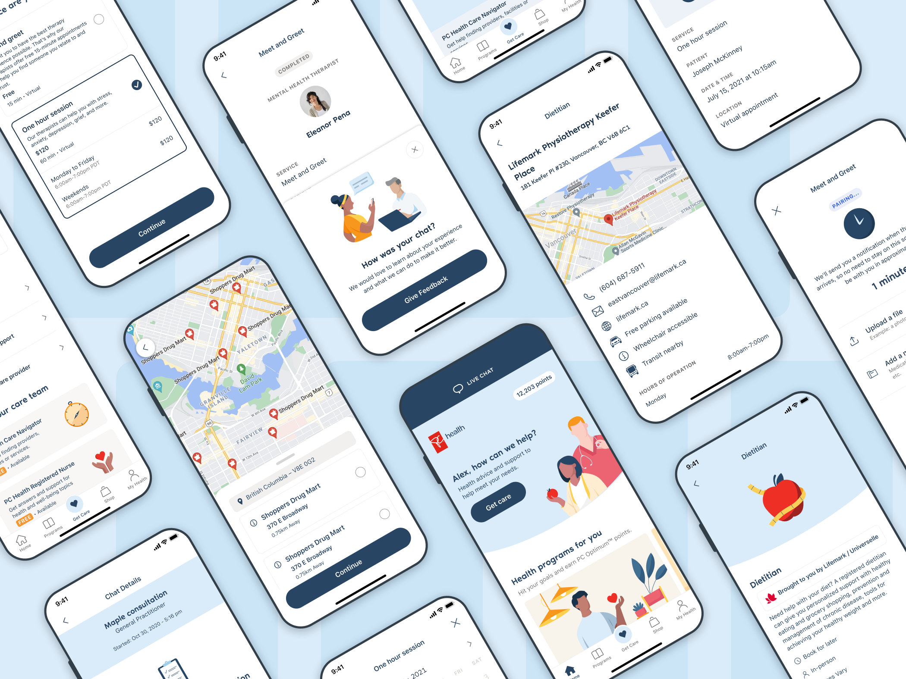
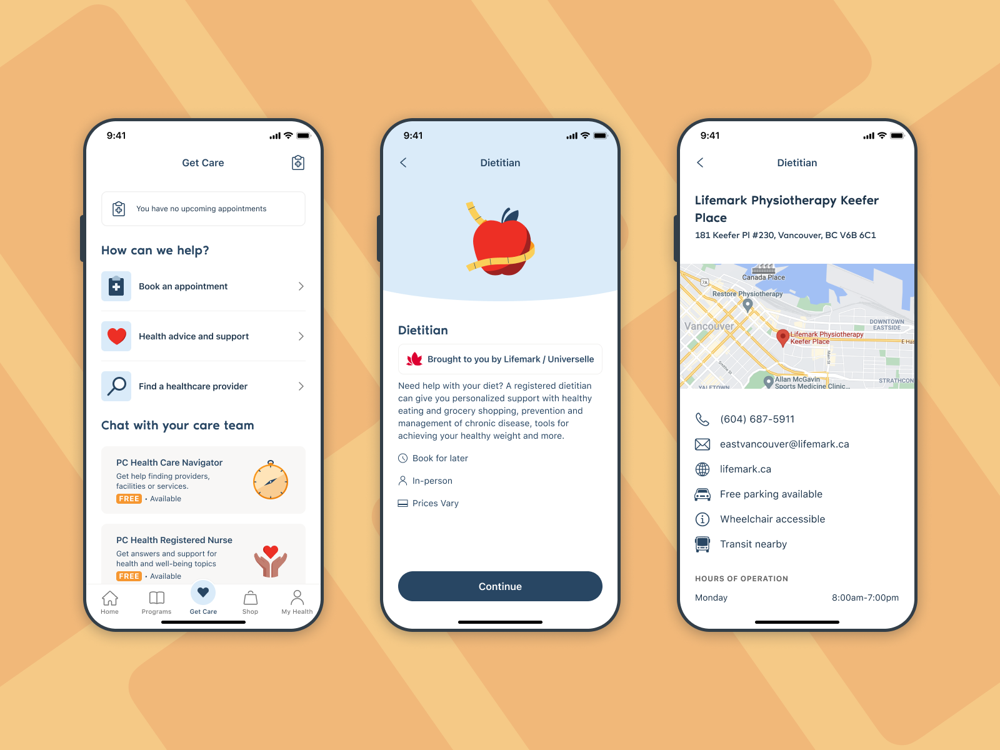
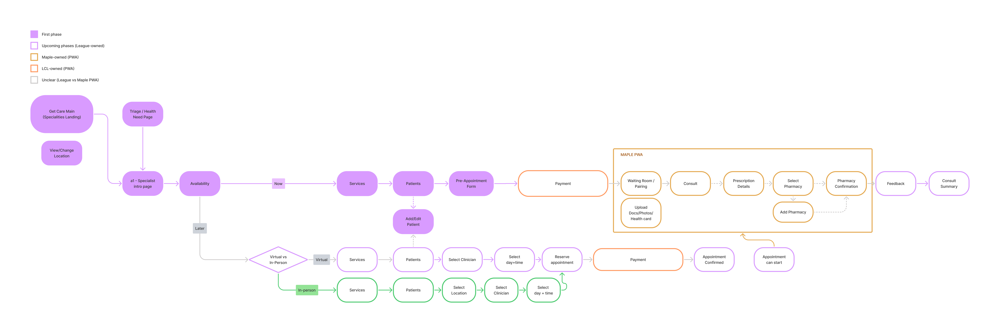
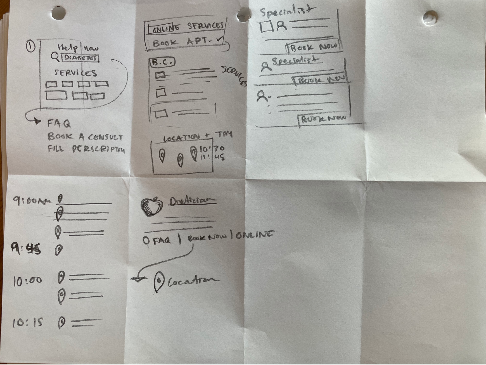
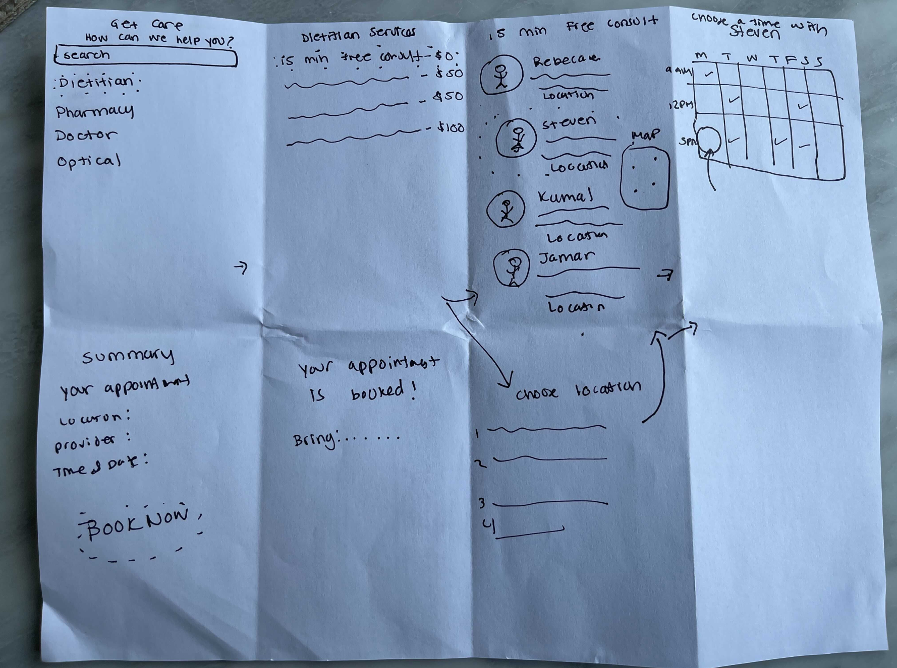
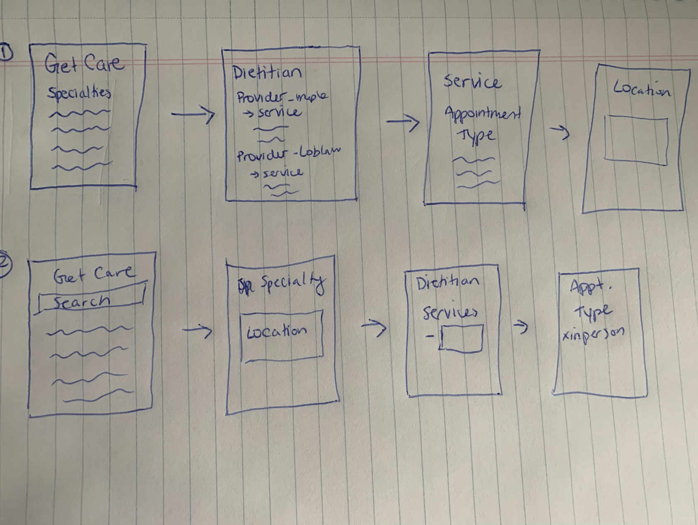
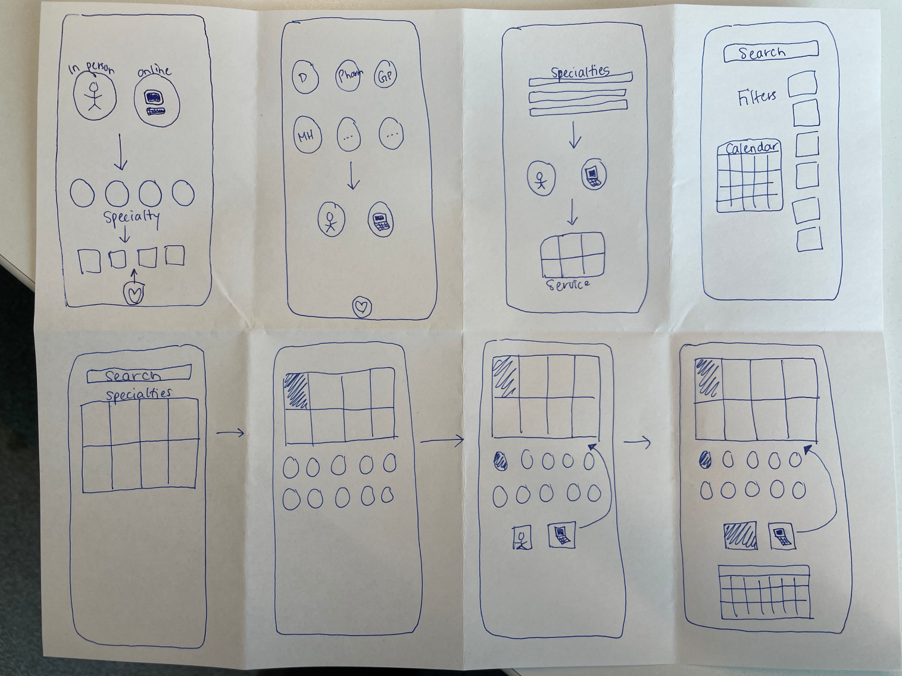
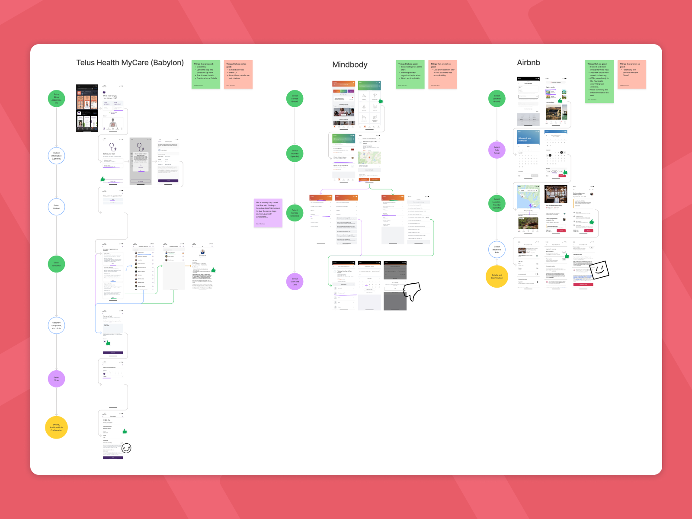
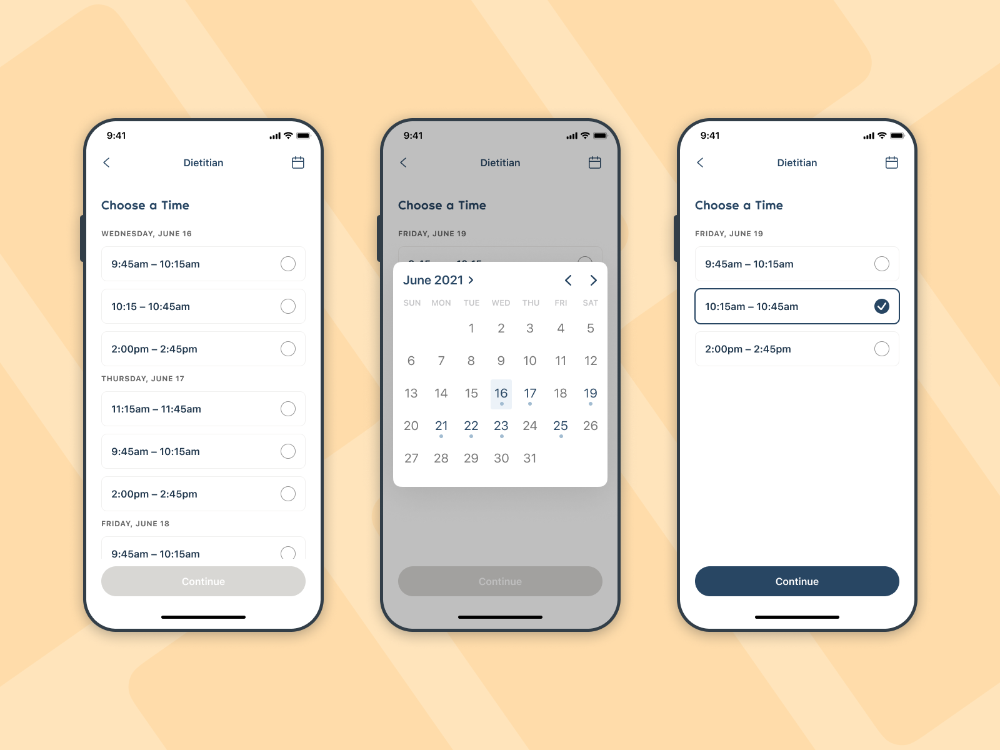
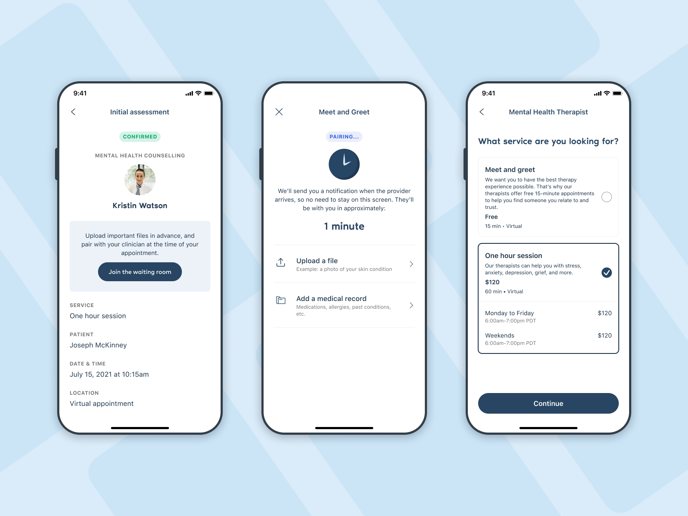

> Designing a health care service booking feature at League

In April 2021, I undertook a project with League to design a 'Service Booking' feature in collaboration with Loblaw Companies Ltd., Maple, and Lifemark. The goal was to enable users to seamlessly book various health services offered by Maple and Lifemark through the PC Health mobile app.

---

### My Role
As the sole designer on the 'Care Services' team, I collaborated closely with product and engineering managers and conducted research, crafted user flows, generated wireframes, and presented design solutions to stakeholders.

---

### Achievements
- Led research efforts, gathering requirements from partners and user feedback.
- Crafted a user flow prioritizing online vs. in-person appointments, leveraging iterative design.
- Produced high-fidelity screens to guide the team and enhance collaboration.
- Played a pivotal role in achieving project milestones within an aggressive 6-month timeline.
- Facilitated productive communication and consensus among cross-functional teams.

|||
--|--
|||

---

### Results
- Successfully launched the Service Booking feature, meeting key goals and attracting new users.
- Provided a flexible platform for partner integration, enhancing revenue opportunities.
- Contributed to PC Health's marketing campaigns through improved service offerings.
- Identified areas for design enhancement post-launch, ensuring continuous improvement.

---

### Lessons Learned
- Emphasized the need for comprehensive written requirements to complement design.
- Recommended establishing clear stakeholder sign-off and a change log for smoother development.
- Highlighted the importance of alignment between partners and consistent requirement delivery.

This project underscores the value of user-centric design and effective collaboration, resulting in a cutting-edge healthcare service booking feature that aligns with League's mission of promoting better health and wellbeing.

