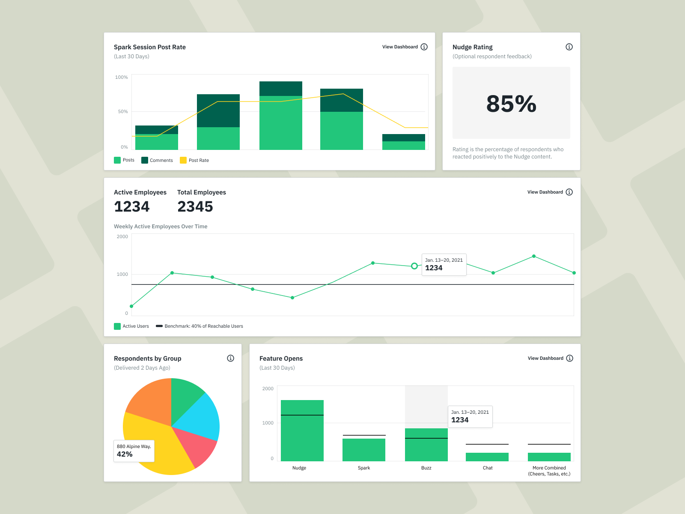
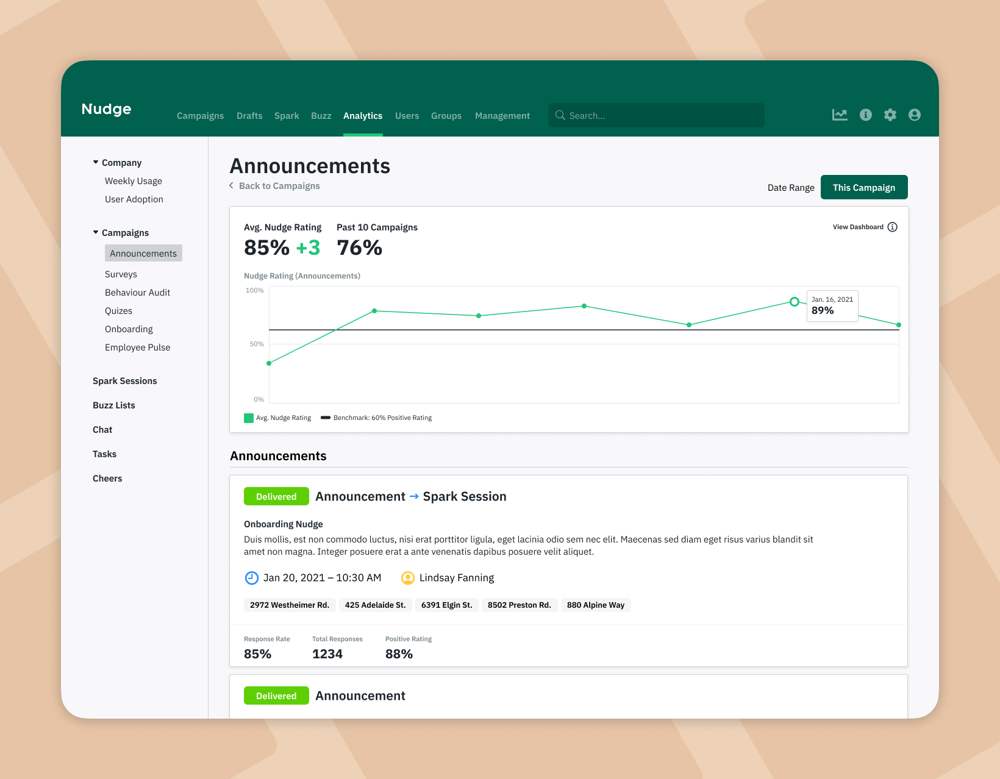
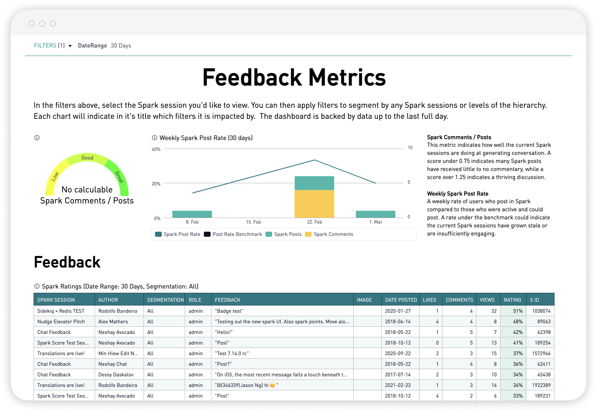
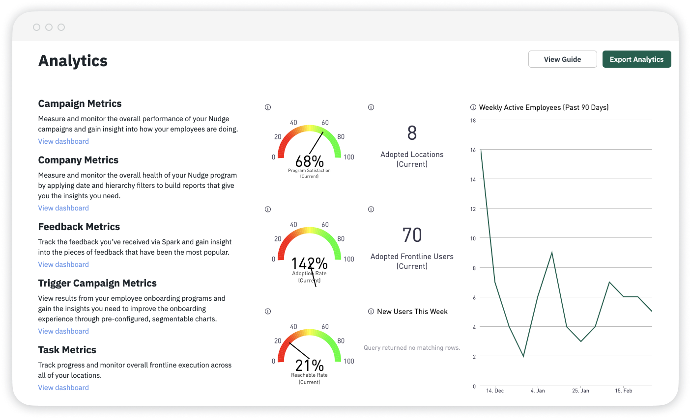
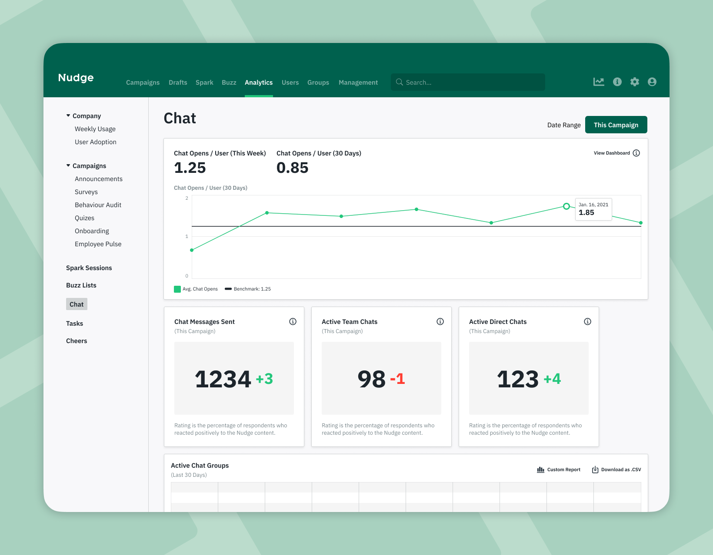
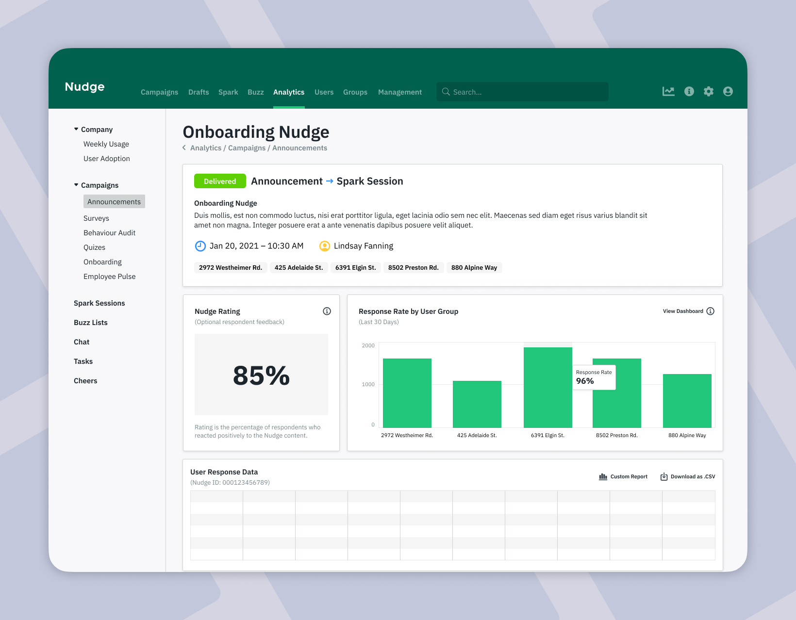
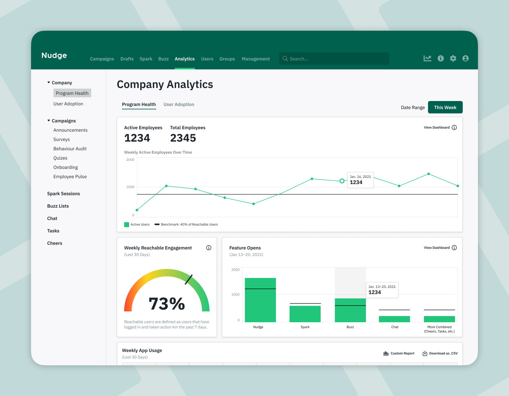

> Revamping the Nudge Analytics Dashboard

---

### Project Overview
The Nudge Analytics Dashboard project sought to transform the user experience and effectiveness of analytics within the Nudge CMS platform. The aim was to provide clearer, actionable insights to program managers and CS teams by reimagining the existing dashboard layout and addressing performance and usability issues.

---

### Key Problems Identified
1. Slow loading times due to multiple charts and elements.
2. Complex and opaque metrics leading to confusion.
3. Low discoverability of relevant dashboards.

---

### Proposed Solution
- **Organized Dashboards**: Reorganized dashboards by in-app features for intuitive navigation, allowing program managers to gain insights into specific program areas quickly.

- **Focused Pages**: Limited dashboards to 6 charts or tables per page to reduce load times and cognitive load, enhancing usability.

- **Progressive Hierarchy**: Introduced a natural hierarchy for insights, emphasizing general performance and content stats, while enabling exploration of more complex data.

- **Accessible Exports**: Provided upfront access to data tables for exporting, catering to unique or one-time analysis requests.

### My Role
I led the design efforts for this project, addressing user needs and technical challenges. Responsibilities included conducting user research, creating modular graph components, and crafting polished screens that depict the ideal state of Nudge's analytics.

### Achievements
- Conducted user interviews to identify pain points and gather insights.
- Designed modular graph components for consistency and ease of use.
- Developed an intuitive dashboard layout, improving user access and discoverability.
- Emphasized user-centric hierarchy for insights, enhancing relevance and actionable data.

### Outcomes
The revamped Nudge Analytics Dashboard promises to provide program managers and CS teams with a more seamless, insightful experience. By prioritizing usability and performance, this redesign is poised to enhance decision-making and optimize operations, aligning with Nudge's commitment to empower users with data-driven insights.

