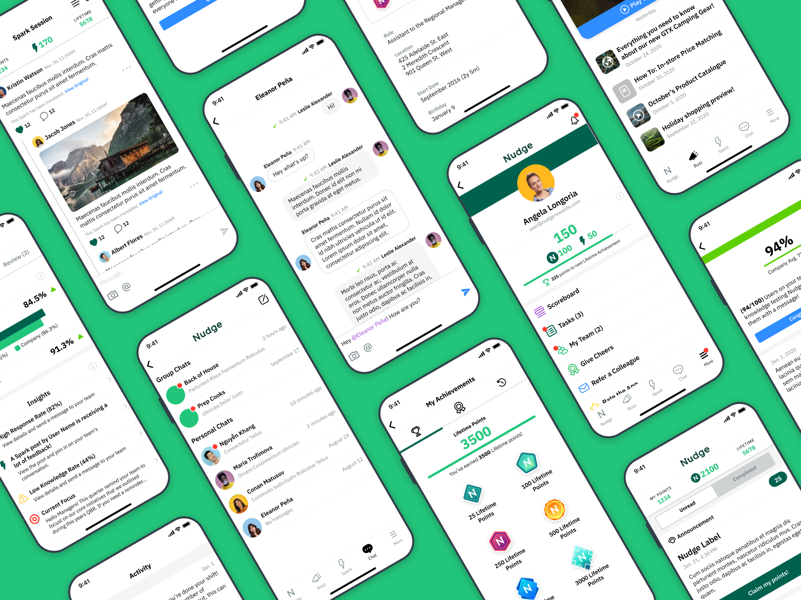

> Building (and re-building) a comprehensive design system and library

### Project background;
After transitioning to a full-time design role at Nudge, our Product team was moving faster than ever creating and planning features for the app. Similarly, our engineering team was building at an unprecedented pace - both on the mobile and backend teams. As a result, I was inundated with requests from all areas of the business to create mocks for upcoming features, and produce mocks of existing features for marketing or sales purposes.

I decided it was time to set up a design system and library in Sketch. My project goals were to:
- Allow for quick iteration on new designs.
- Ensure consistency across new and existing features.
- Have adaptable and easy to produce mockups for our Marketing, CS, and Sales teams.

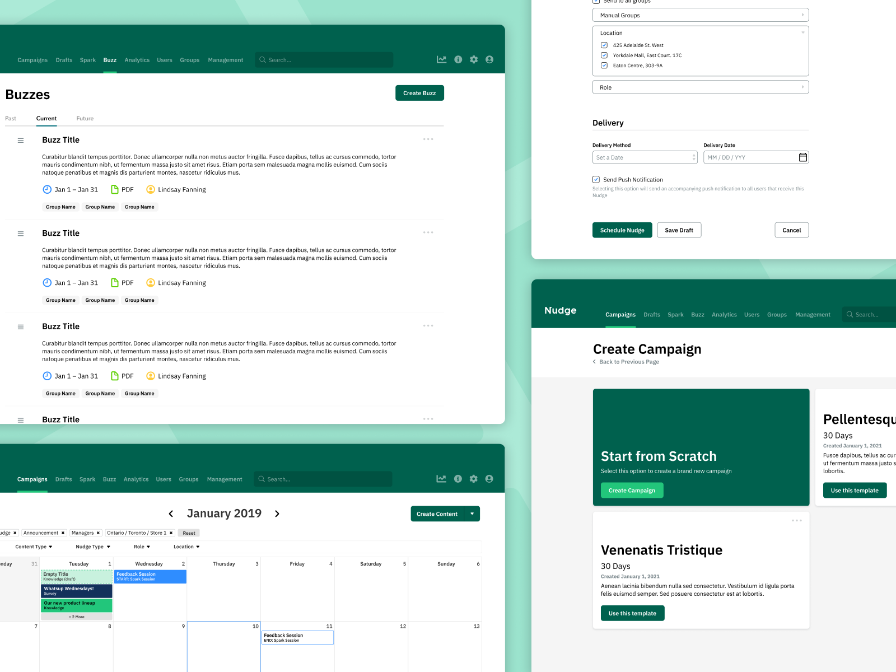

---

#### Build Strategy 
After doing some research I decided to approach the library by loosely following an Atomic Design System. I thought this system was appropriate because it would allow for cascading changes, which would ensure consistency, and allow for creating quick mocks of our features.

I didn’t feel that it was important to strictly follow this pattern, but I did believe it would provide an excellent starting point from which I could adapt and update to suit our own needs.

After building the first series of components and screens, I decided to keep two separate libraries. The first would contain the atoms, and molecules – common items like navigation, buttons, and entry fields that are used across many different screens in the app. I named this file the ‘App Components Library’. The second file would contain templates, and the organisms used to build those templates. This file was named the ‘App Screens Library’. I settled on this approach for a number of reasons:

- Keeping atoms and molecules in one ‘Components’ library created an easy reference for developers to build matching components in code.
- When building out completely new features, importing a single ‘Components’ library kept things tidy, but still consistent.
- Separating templates and organisms into a ‘Screens’ library was simple for the CS and Marketing teams who didn’t need or want access to smaller components.
- The ‘Screens’ library could be neatly organized by feature, allowing for quick export of product mocks.

|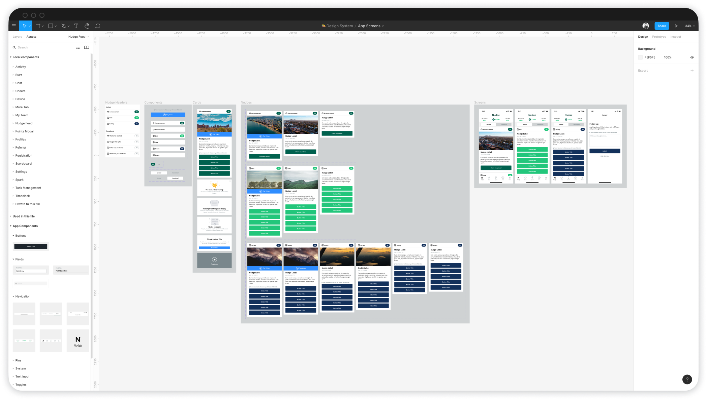|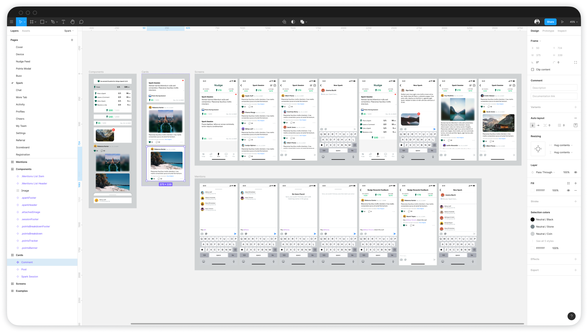|
---|---
|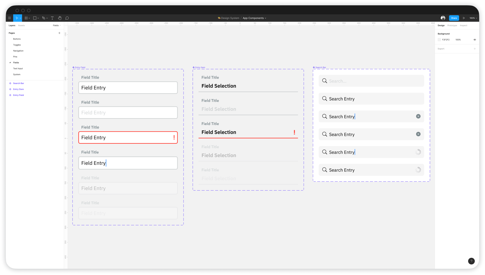|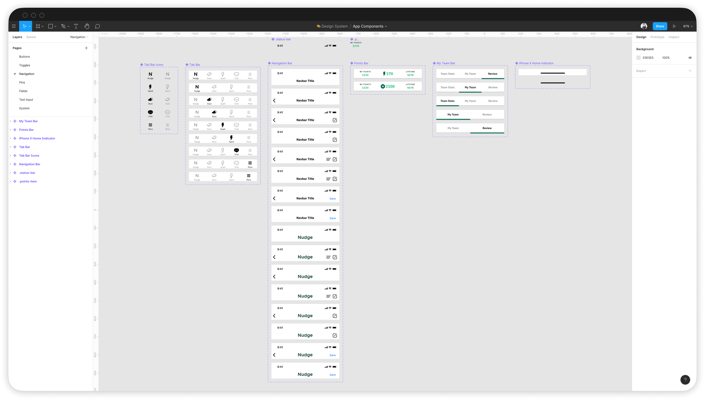|

---

#### Usage and Updates
Creating the library required a lot of initial effort, however the impact it had on my day to day design process is almost immeasurable. It entirely eliminated the need to recreate existing components, or dig through old files to find a component I had already made. It also allowed me to view all the components in the app side by side, and share text and colour styles across all of them - ensuring consistency in designs from feature to feature.

An even larger impact these libraries would have was on the rest of the company. Our engineering team was able to replicate the libraries’ components in code, including the various text and colour styles. This lead to shorter development times, fewer guesses while interpreting designs, and more consistency across the app and between mobile platforms.

Furthermore, our Marketing, CS, and Sales teams were able to take advantage of quick access to the flexible feature screens. Though we didn't have an in-house graphic designer, other members of the team were able to use the Sketch library to quickly update copy and images to suit their specific needs. The library also resulted in fewer ‘broken’ mocks, and stronger overall content produced.

Finally, I was able to use our libraries to create a new type of resource for white-labeling product mockups. By leveraging our usage of colour styles in the library, I was able to create a Sketch document that will cascade changes to those colour styles through every feature mock in a way that replicates our in-app feature for white-labeling.

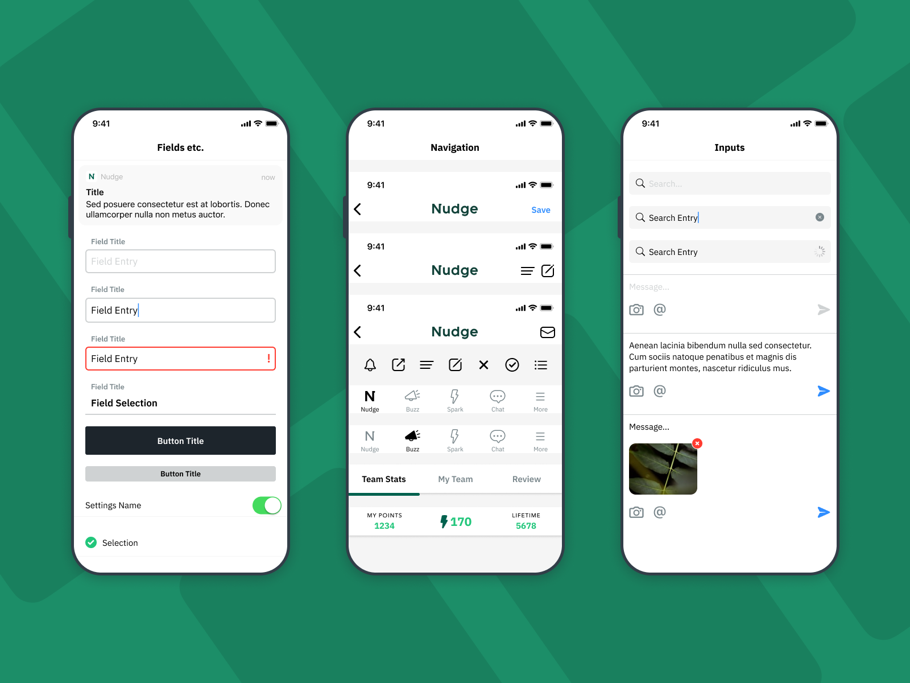

---

#### 2 Years later, and the transition to Figma
For over 2 years using and building out the Sketch library with new features and updates had become part of my regular workflow, and its usage was widespread throughout the company. However, I was noticing that some product mockups being produced still had out of date designs or inconsistencies. After talking with our team, I discovered a few areas where they were struggling with the current implementation, and began thinking about how to best address them.

Team members were often neglecting to update the library, and would frequently detach symbols from the library in order to make small adjustments to components. These changes were easy to integrate into the design system, but members of the CS or marketing teams didn’t have an easy way to submit requests for those updates. Instead of starting from the library each time, they would duplicate their old files where they had made these tweaks.

It was around this same time that I had begun work on our company re-brand project, and needed a lot of back-and-forth collaboration with other teams.

After a lot of research, and a couple deep breaths…I decided it was time to transition the team to Figma. As I saw it, Figma would have a few key advantages over Sketch.

|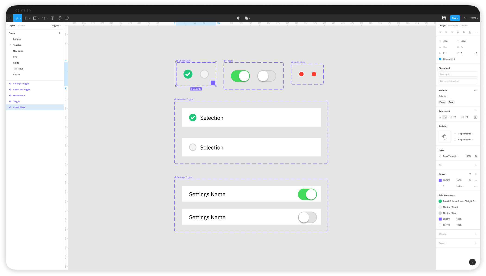|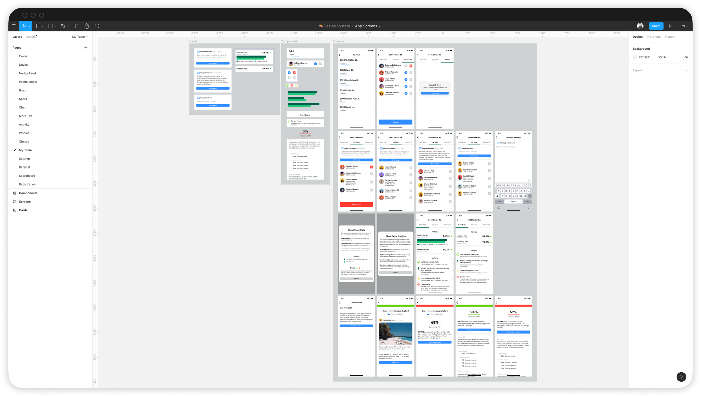|
---|---
|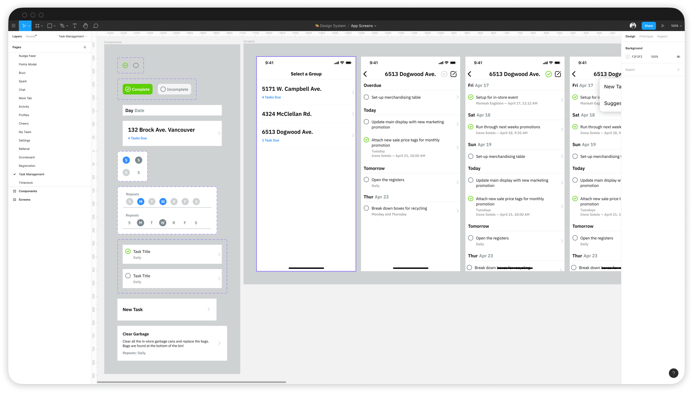|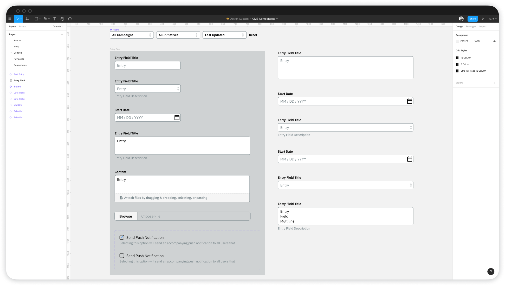|

- **Files are always up to date, and users have no need to keep out of date file versions**
While Figma does support file versioning, the latest files are always distributed to the team - there’s no need for me as the designer to post a new version in Slack or to a Google Drive, and to make sure everybody updates their libraries.

- **Collaboration is key!**
With Figma it’s incredibly easy to invite users to view files and leave comments. This has drastically improved the process for leaving feedback on designs, requesting updates to the libraries, and even for our CS and Marketing teams to get help with their own design files.

- **Transparency and shared files**
After years of hoarding Sketch files and cautiously sending around product mocks, knowing that they would return 2 years later, out of date, in a Powerpoint presentation – I decided that transparency was the best policy, and that giving access to all of my design files would help the broader team.

I’m happy to say that the switch to Figma has been a huge success. Since the transition, I’ve been able to successfully recreate and improve upon the design system and extend it to our web-based CMS. We have even fewer mistakes with product mocks, and many more teammates using Figma than we ever had using Sketch. On top of that, the use of comments and other collaboration tools have transformed the process not just for providing mocks to CS and marketing, but our product process as well. We’ve been able to invite developers into Figma to leave feedback on designs, have PMs suggest updates, and marketing team members suggest copy edits. With Figma’s introduction of Auto-layout and Variants, I’ve been able to further organize and update the components to become increasingly powerful and flexible.

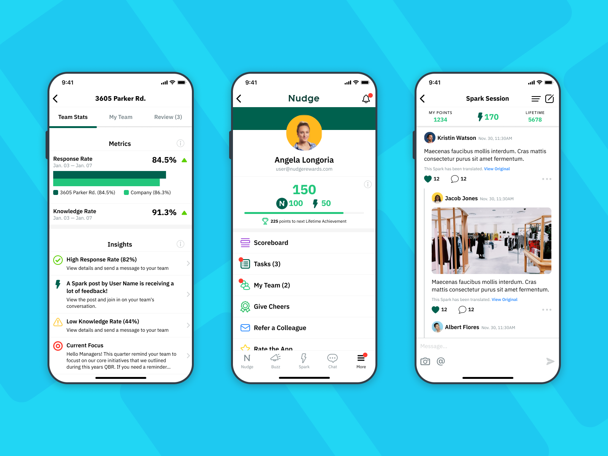