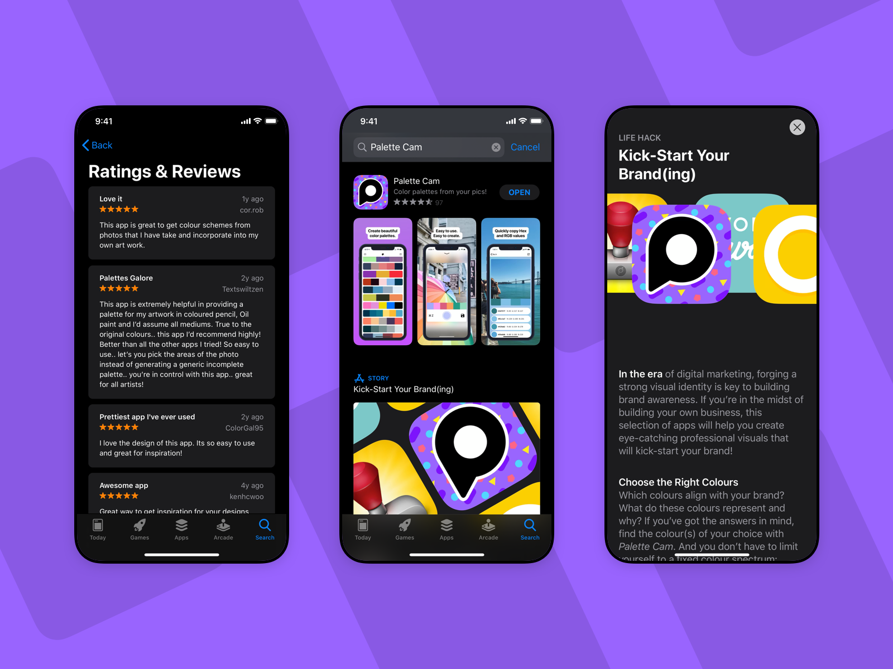
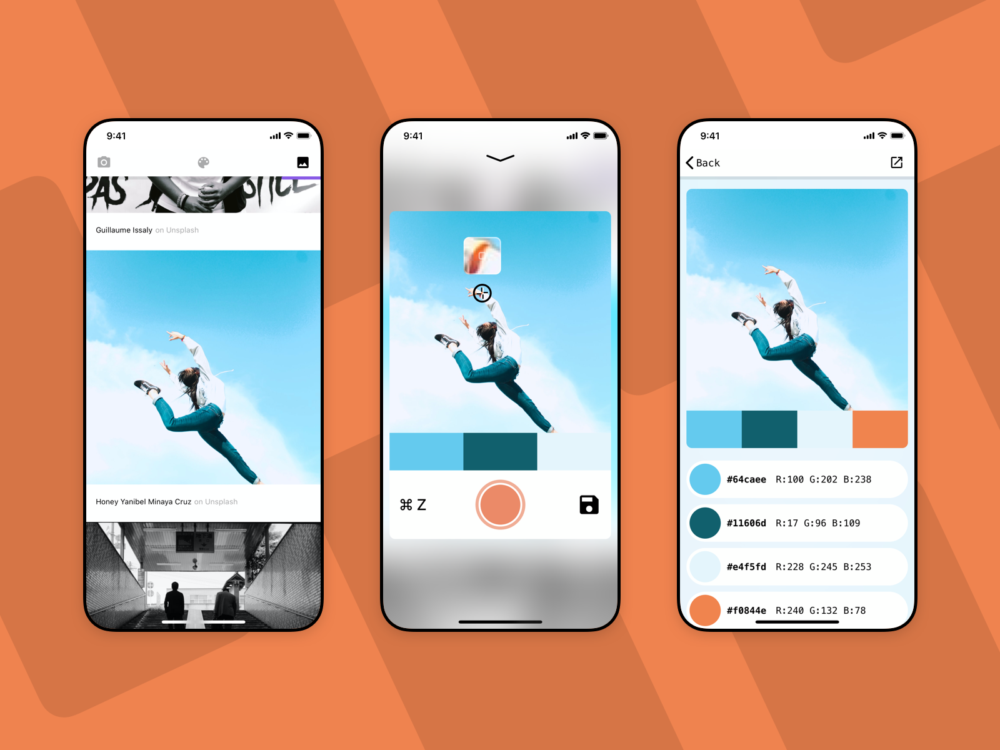
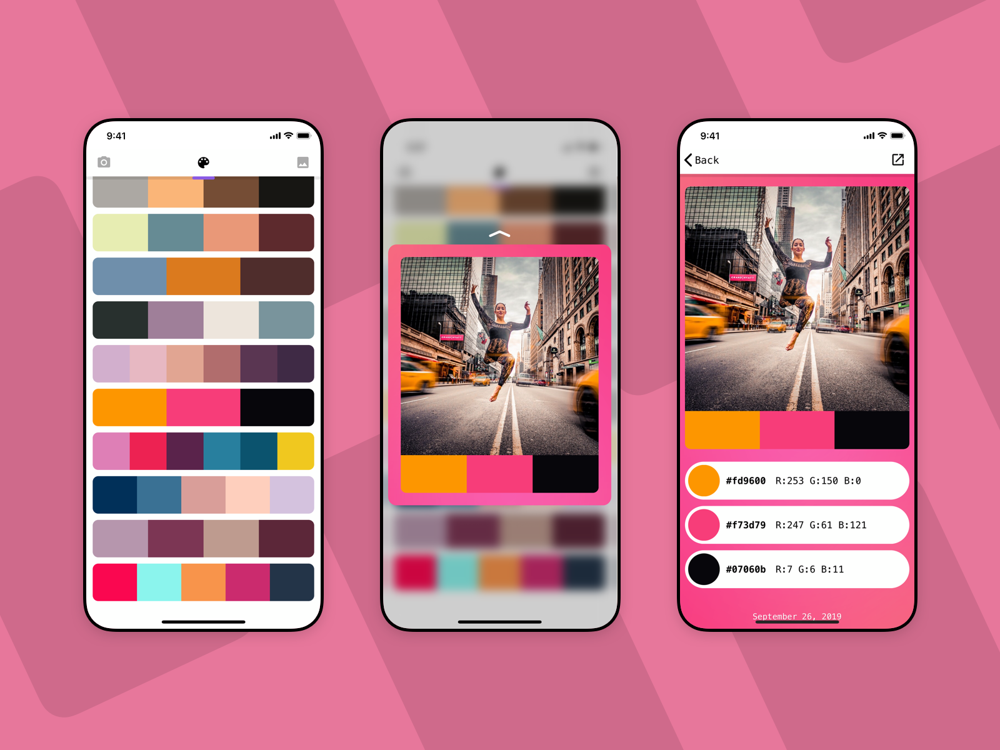
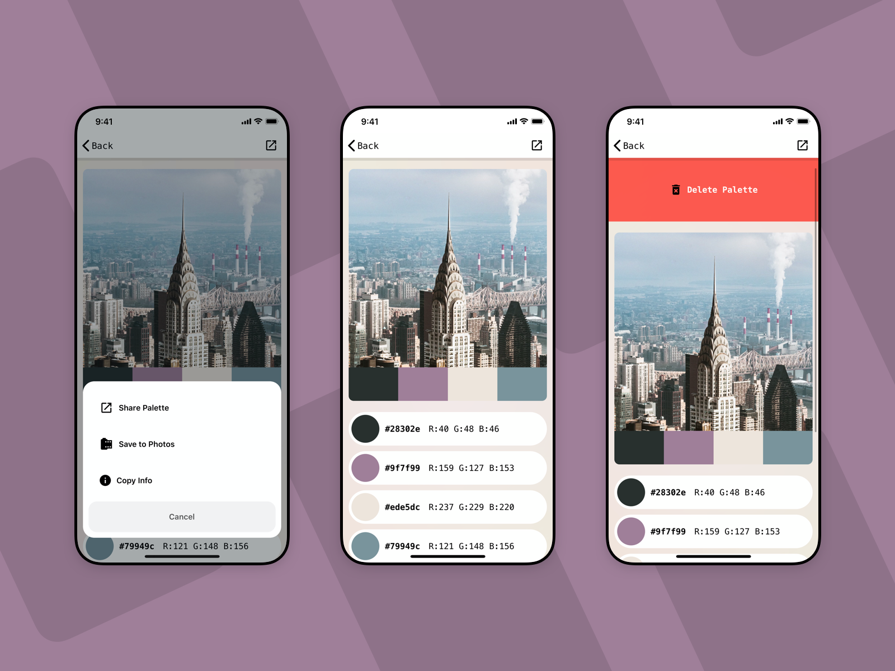

> Over 300,000 downloads, and a 4.6 rating on the iOS App store

### tldr;
Palette Cam is an iOS app that helps you create colour palettes from photos. I designed and built Palette Cam during my time at the Lighthouse Labs iOS Development bootcamp in Toronto, ON. and maintained the app for a few years afterward. Palette Cam is still available on the iOS App store today, and continues to receive steady downloads and positive ratings from happy users.

---

#### Impact and Usage 
- Over 300,000 downloads on the iOS App store
- An average 4.6 star rating from over 1,200 reviews in all territories
- Featured on the App Store in the 'Kick-Start your Brand(ing)' story
- $0 spent on marketing or ads

###### Love it ⭐️ ⭐️ ⭐️ ⭐️ ⭐️

> This app is great to get colour schemes from photos that I have take and incorporate into my own art work. **— cor.rob**

###### Prettiest app I've ever used ⭐️ ⭐️ ⭐️ ⭐️ ⭐️

> I love the design of this app. Its so easy to use and great for inspiration! **– ColorGal95**

###### Great app. Simple to use. ⭐️ ⭐️ ⭐️ ⭐️ ⭐️

> Great little colour sampling app. Simple, quick interface... **– Pulpoco**

---

#### Project Goals
There were a number of goals I had for Palette Cam when I first started building that helped guide the development and product decisions throughout the process.

1. **The app should be about utility**
Similar to a flashlight, calculator, or ruler app - I wanted Palette Cam to focus on a single promise and deliver it seamlessly without feature bloat.

2. **Focus on design and ease of use, to provide the best possible experience**
I wanted to lean on my experience as a designer to help Palette Cam stand out from other colour apps and provide a bug-free, interaction-rich, joyful experience.

3. **Be ready for the App Store**
This goal was maybe the most ambitious as it wasn’t a requirement for the Lighthouse Labs demo, but as a personal goal I had wanted to come out of my time in the bootcamp with an app that I could show friends and employers, ready to be downloaded to their own devices.

---

#### Technologies Used
When I first launched Palette Cam shortly after graduating Lighthouse Labs, I relied solely on technology provided by Apple, and a single API from Flikr for the photo feed. Palettes were stored quickly in User Preferences, and I used standard UICollectionViews and other UIKit elements throughout to keep things lightweight and straightforward.

Though even as I began to work full-time as a developer I continued to work on Palette Cam in my spare time. The app became a sort of testing ground for things I was curious about, and since launching I’ve introduced several new technologies and updates to the original app.

- **IGListKit**
I picked up this tech knowing that it was overkill for my simple app (a common theme). However, the promise of easy to implement collection views, and auto-diffing with animations was really appealing so I used Palette Cam as a testing bed before eventually introducing it to my work at Nudge as well!
- **Realm**
I wanted a replacement for the quick and dirty solution of storing Palette objects in User Preferences, and Realm provided an easy and free solution to real-time data storage.
- **Unsplash**
I’ve updated the inspiration page to use an infinitely scrolling feed of photos from the Unsplash API to ensure users can start with the best quality photos.
- **In-App Reviews**
Another instance of testing on Palette Cam before bringing it to Nudge - the use of in-app reviews contributed to a massive influx of user feedback on both the Palette Cam and Nudge apps, which each maintain a 4.6+ rating.
- **SwiftUI**
As soon as SwiftUI was announced at WWDC in 2019, I knew I would eventually want to re-write Palette Cam to take advantage of its easy to build views and animations. After struggling through early betas and an immature platform, a rebuild has finally started to take shape. More importantly though, I’ve learned that SwiftUI is an incredible tool for prototyping in my day-to-day design work!

 
