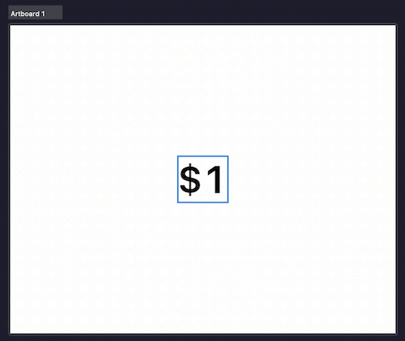
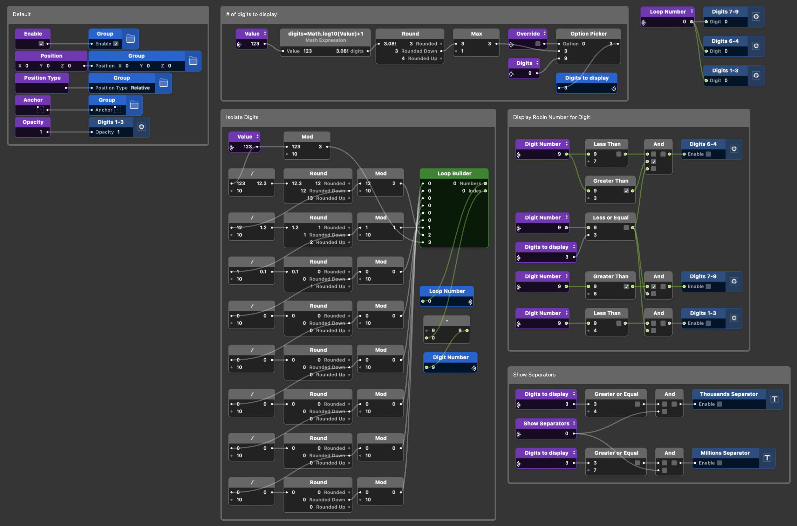
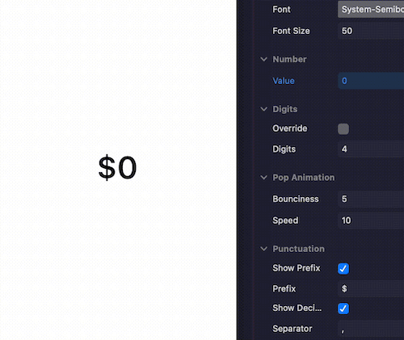

> Custom number animations in Origami studio

---

### Project Overview
In the leadup to BFCM 2023, I was exploring a variety of screens and features that would be displaying numerical data. We wanted some of the key metrics to have a noticeable and exciting animation when they updated. I was prototyping a lot of these features in Origami studio and decided to create a custom component to handle this type of animation.

### Solution
- **Reusable:** by creating a custom component, I was able to use and re-use it across many different iterations of the larger feature prototype
- **Detached:** I was able to iteratively increase the complexity, and isolate the complex logic and individual layers from the rest of the project
- **Handy for developers:** the component was easy to share with developers and provided a template for how to implement the animation in code

### How it works

##### Setup
- The component takes a number of inputs: font, font size, color, number of digits, a prefix such as '$'
- You can lock it to a specified number of digits
- You can add a separator such as ',' for long numbers
- Each digit is it's own component
- Each digit animates separately by scrolling up or down
- Together they create a fluid animation reminiscent of a mechanical device

##### Math
- The component takes in an arbitrary value
- I use a log operation to determine the number of digits
- Then a series of mod operations break the total value into individual digits
- I loop over each digit and and enable or disable them, and set the value for each and they animate individually in to place

